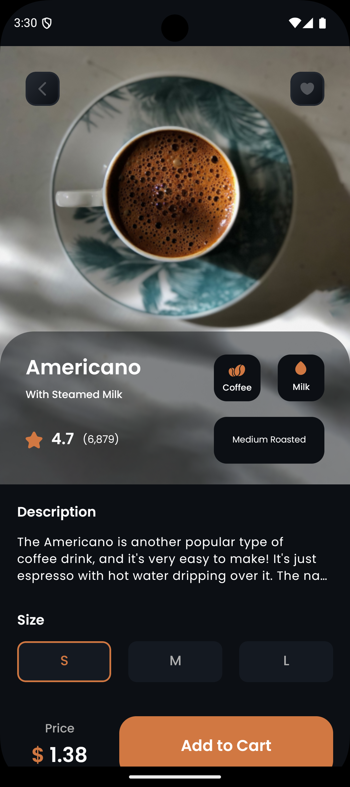

# Coffee House – React Native App

A polished sample coffee ordering app built with **React Native** and **TypeScript**. Browse coffees and beans, view details, manage your cart and favorites, check order history, and simulate checkout with common payment methods.

### Features
- **Home & Details**: Explore curated coffee items and see rich details.
- **Cart**: Add/remove items, adjust quantities, see totals.
- **Favorites**: Save coffees you love for quick access.
- **Order History**: Review your previous orders.
- **Payments (mocked)**: Showcases Apple Pay, Google Pay, and Amazon Pay flows.
- **Smooth UI**: Custom components, gradients, and subtle Lottie animations.

### Tech Stack
- **React Native**: 0.72.4
- **React**: 18.2
- **TypeScript**: 4.8
- **Navigation**: React Navigation v6 (bottom tabs + native stack)
- **State Management**: Zustand + Immer
- **Animations**: Lottie
- **UI**: react-native-linear-gradient, react-native-vector-icons
- **Utilities**: Async Storage, react-native-screens, safe-area-context

---

## Screenshots

<p align="center">
  
  
  
</p>
<p align="center">
  
  
  
</p>
<p align="center">
  
</p>

---

## Getting Started

### Prerequisites
- Node.js >= 16
- Yarn (recommended) or npm
- Xcode (for iOS) with command line tools and a valid Apple ID/Team
- Android Studio with SDKs & an emulator
- CocoaPods (for iOS): `sudo gem install cocoapods`

### Install Dependencies
```bash
# from project root
yarn

# iOS pods
cd ios && pod install --repo-update && cd -
```

### Run the App
```bash
# Start Metro in one terminal
yarn start

# Android (in another terminal)
yarn android

# iOS (in another terminal)
yarn ios
```

If you run into environment issues, follow the official React Native setup guide and ensure your emulators/simulators are configured.

---

## Project Structure (high level)
```
src/
  assets/
    app_images/           # Icons used in UI
    coffee_assets/        # Coffee imagery (portrait/square)
    fonts/                # Poppins + custom icon font
    screenshots/          # README images (linked above)
  components/             # Reusable UI components
  data/                   # Static coffee/beans data
  lottie/                 # Lottie JSON animations
  navigators/             # Tab and stack navigators
  screens/                # App screens
  store/                  # Zustand store
  theme/                  # Colors, spacing, typography
```

---

## Testing
```bash
yarn test
```

---

Built with ❤️ using React Native & TypeScript
